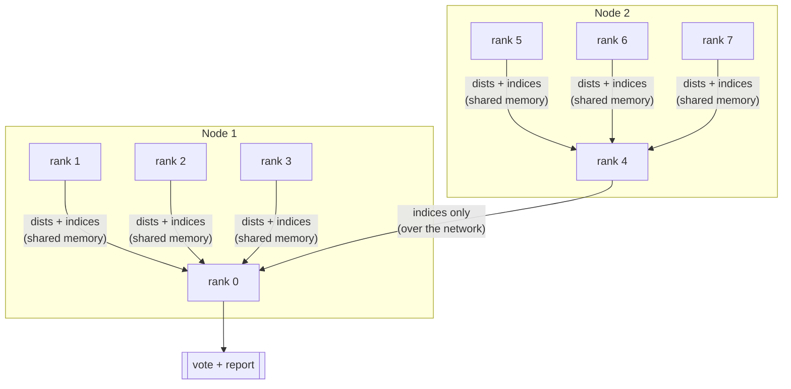

# Distributed k-Nearest Neighbours with MPI

An exact k-NN search and classifier parallelised across MPI ranks and nodes. Given a
labelled dataset and a batch of queries, it finds each query's `k` nearest neighbours by
squared Euclidean distance and assigns a label by plurality vote.

The search is exact and brute-force — no approximate index, no pruning heuristics that
change results. All the speed comes from how the `O(N · Q · A)` work is partitioned,
how the inner loop uses cache, and how partial results are merged across the network.

## Build

Requires an MPI implementation providing `mpicxx` (developed against Open MPI).

```
make
```

Produces two binaries:

| Binary | Built with | Output |
| --- | --- | --- |
| `engine` | `-O3` | FNV-1a checksum per query (compact, for comparison) |
| `engine.debug` | `-O3 -DDEBUG` | Predicted label plus the full neighbour list |

## Running

The program reads from stdin on rank 0 and writes results to stdout; wall-clock time for
the search goes to stderr.

```
mpirun -n 8 ./engine < inputs/input1.in
```

### Input format

```
N Q A                      # points, queries, attributes per vector
<label> <a1> <a2> ... <aA> # × N  dataset rows
Q <k> <a1> <a2> ... <aA>   # × Q  query rows, each with its own k
```

Generate synthetic inputs with the included script:

```
python3 generate_input.py --num_data 100000 --num_queries 2000 --num_attrs 32 \
    --min 0 --max 100 --minK 5 --maxK 50 --num_labels 10 --output inputs/test.in
```

### Tie-breaking

Both tie-breaks are deterministic, so output is reproducible regardless of rank count:

- **Equal distance** — the neighbour with the *larger* dataset index wins.
- **Equal vote count** — the *larger* label wins.

## How it parallelises

Rank 0 is the only rank that reads input, so `Engine::KNN` starts by broadcasting the
problem dimensions. It then picks one of two distribution strategies based on the shape
of the workload:

```
num_queries * 2 < num_data   →   distribute data
otherwise                    →   distribute queries
```

### Query distribution (many queries)

Broadcast the dataset once, scatter the queries. Each rank computes final top-k for its
own slice of queries, so the merge is a single `MPI_Gatherv` with no reconciliation —
the results arrive already correct.

### Data distribution (few queries, large dataset)

Broadcasting an `N × A` dataset to every rank is the expensive direction when `N` is
large, so instead the dataset is scattered and the (small) query set is broadcast. Every
rank now holds a *partial* top-k for *every* query, and those partials must be merged.

That merge is where the network cost lives, so it is done topology-aware in two stages:



1. **Intra-node tree reduction.** `MPI_Comm_split_type(MPI_COMM_TYPE_SHARED)` builds a
   communicator per physical node. Ranks merge pairwise up a binary tree in
   `log(node_size)` rounds. This traffic never leaves the node, so full
   `(distance, index)` pairs are sent.

2. **Cross-node index-only merge.** Node leaders send *only* the integer indices to rank
   0 — 4 bytes per candidate instead of 12. Rank 0 still holds the full flattened dataset
   from the scatter, so it recomputes the distances locally. Trading a small amount of
   arithmetic for a ~3× reduction in cross-node bytes is a good deal when the
   interconnect is the bottleneck.

Both merge stages are linear passes over two sorted runs, so merging never costs more
than `O(k_max)` per query per round.

### The inner loop

The distance kernel processes queries in tiles of 8 rather than one at a time:

```
for each block of 8 queries:
    for each local data point:        # streamed once, stays in L1/L2
        for each attribute:
            accumulate 8 partial distances
```

Each dataset row is loaded from memory once and reused across all 8 queries in the tile,
which turns a memory-bound loop into a compute-bound one and gives the compiler a clean
8-wide pattern to vectorise. Each query keeps a bounded max-heap of size `k`, so a
candidate is only inserted when it beats the current worst neighbour — the common case
is a single comparison and no heap operation at all.

## Benchmarking

`run_bench.sh` runs the engine against reference binaries in [benchmarks/](benchmarks/)
under Slurm, across four pre-defined heterogeneous two-node configurations (24–40 tasks
on mixed i7-7700 / i7-13700 / w5-3423 hardware).

```
unzip inputs.zip        # extract inputs/ first
./run_bench.sh 1        # single config
./run_bench.sh all      # every config
./run_bench.sh clear-cache
```

For each config it reports a timing delta against the reference and a byte-exact
correctness check of the checksum output. Reference runs are cached per exact allocated
node combination, since Slurm may hand out different physical machines between runs and
timings are only comparable within the same allocation.

## Layout

| File | |
| --- | --- |
| [engine.cpp](engine.cpp) | The parallel k-NN implementation — all of the interesting code |
| [engine.h](engine.h) | `Engine` interface |
| [common.cpp](common.cpp) | Input parsing, result reporting, timing, `main` — fixed harness |
| [common.h](common.h) | `Params`, `DataPoint`, `Query` definitions — fixed harness |
| [generate_input.py](generate_input.py) | Synthetic input generator |
| [run_bench.sh](run_bench.sh) | Slurm benchmark and correctness harness |
| [plan.md](plan.md) | Design notes written before implementation |
